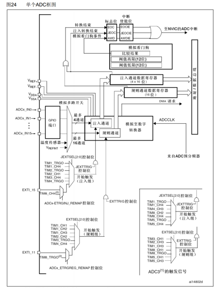

ADC可以将引脚上连续变化的模拟电压转换为内存中存储的数字变量，建立模拟电路到数字电路的桥梁

- 12位逐次逼近型ADC，1us转换时间
- 输入电压范围：0~3.3V，转换结果范围：0~4095
- 18个输入通道，可测量16个外部和2个内部信号源
- 规则组和注入组两个转换单元
- 模拟看门狗自动监测输入电压范围

STM32F103C8T6 ADC资源：ADC1、ADC2，10个外部输入通道
---
常见引脚：
- AO（Analog Output）—— 模拟输出 ：输出连续变化的模拟电压
- DO（Digital Output）—— 数字输出 ：输出一个高低电平（0 或 1）

AO常接到 MCU 的 ADC 引脚（具体哪个引脚由引脚定义决定）通过 ADC 读取电压值，再转换为数字量（0～4095）或电压值。
当AO口电压高于阈值（模块上常有一电位器用于调节阈值电压）时DO输出高电平/低电平。

## 框架

