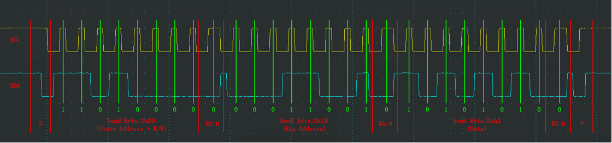
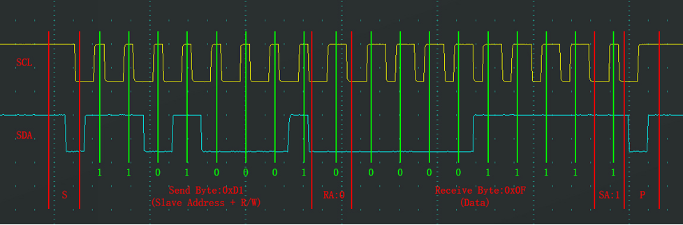
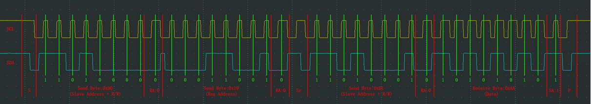

# 特点
- 两根通信线：SCL（Serial Clock）、SDA（Serial Data）
- 同步，半双工
- 带数据应答
- 支持总线挂载多设备（一主多从、多主多从）
- 高位先行（常见模式）
- I²C 通信中，当主机向从机发送寄存器地址后，从机内部地址指针指向该地址。如果之后继续发送/接收数据，每次完成一个字节的传输，地址指针自动加 1，指向下一个寄存器。这样主机无需重复发送寄存器地址，就能连续读写多个连续寄存器

要求：
- 所有I2C设备的SCL连在一起，SDA连在一起
- 设备的SCL和SDA均要配置成开漏输出模式
- SCL和SDA各添加一个上拉电阻，阻值一般为4.7KΩ左右
I²C 总线采用 开漏输出 结构，SCL 和 SDA 线上都接有上拉电阻。设备通过将引脚拉低来输出逻辑 0，通过将引脚设置为高阻（开漏输出高电平或输入模式）来输出逻辑 1，此时总线电平由上拉电阻拉高

## 时序
- 空闲状态：SCL高电平 SDA高电平

- 起始条件（START）:SCL 保持高电平期间，SDA 产生下降沿。

这表示通信开始，总线进入忙状态。

- 停止条件（STOP）:SCL 保持高电平期间，SDA 产生上升沿。

这表示通信结束，总线回归空闲状态

- 数据传输：数据位在 SCL 低电平期间改变，在 SCL 高电平期间保持稳定。

简单来说主机/从机在SCL低电平期间先将数据位置于SDA线上，然后主动释放SCL（置高电平）使从机/主机接收数据位，最后再主动拉低SCL（置低电平）

- 应答位：进行一个字节的数据传输后的下一时钟的数据位在IIC协议中为 应答位 1表示非应答 0表示应答

发送方应接收应答位以判断数据是否被接收成功 接收方应发送应答位以表明数据是否接收成功

## 指定地址写

## 当前地址读

## 指定地址读

