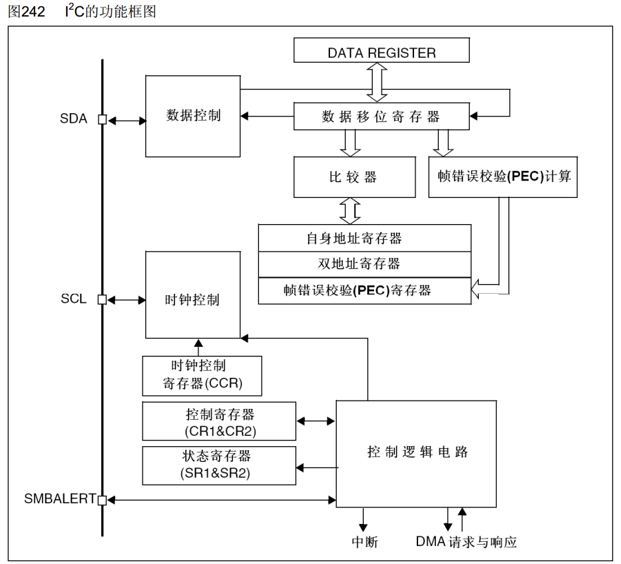

# 硬件
-  I²C 通信中，当主机向从机发送寄存器地址后，从机内部地址指针指向该地址。如果之后继续发送/接收数据，每次完成一个字节的传输，地址指针自动加 1，指向下一个寄存器。这样主机无需重复发送寄存器地址，就能连续读写多个连续寄存器

## 1.常量宏
### 1.1 模式选择 I2C_Mode
- I2C_Mode_I2C：标准 I²C 模式（最常用）
- I2C_Mode_SMBusDevice：SMBus 设备模式
- I2C_Mode_SMBusHost：SMBus 主机模式
### 1.2 占空比 I2C_DutyCycle
用于快速模式（400kHz）：
- I2C_DutyCycle_16_9：Tlow/Thigh = 16/9
- I2C_DutyCycle_2：Tlow/Thigh = 2（推荐）
### 1.3 应答使能 I2C_Ack
- I2C_Ack_Enable：使能 ACK
- I2C_Ack_Disable：失能 ACK（用于最后一个字节）
### 1.4 传输方向 I2C_Direction
- I2C_Direction_Transmitter：发送（写）
- I2C_Direction_Receiver：接收（读）
### 1.5 地址位数 I2C_AcknowledgedAddress
- I2C_AcknowledgedAddress_7bit：7 位地址
- I2C_AcknowledgedAddress_10bit：10 位地址
### 1.5FLAG
| 标志宏 | 含义 | 清除方式 |
| :--- | :--- | :--- |
| `I2C_FLAG_AF` | 应答失败（NACK） | 软件写 0 到 SR1 的 AF 位 |
| `I2C_FLAG_BERR` | 总线错误 | 软件写 0 到 SR1 的 BERR 位 |
| `I2C_FLAG_ARLO` | 仲裁丢失 | 软件写 0 到 SR1 的 ARLO 位 |
| `I2C_FLAG_OVR` | 溢出/欠载错误 | 软件写 0 到 SR1 的 OVR 位 |
| `I2C_FLAG_PECERR` | PEC 错误 | 软件写 0 到 SR1 的 PECERR 位 |
| `I2C_FLAG_TIMEOUT` | SMBus 超时 | 软件写 0 到 SR1 的 TIMEOUT 位 |
| `I2C_FLAG_SMBALERT` | SMBus 警报 | 软件写 0 到 SR1 的 SMBALERT 位 |
| `I2C_FLAG_STOPF` | 停止条件检测（从机模式） | 读取 SR1 后写 SR1 的 STOPF 位为 0 |
| 标志宏 | 含义 | 自动清除条件 |
| :--- | :--- | :--- |
| `I2C_FLAG_SB` | 起始条件已发送 | 当向 `DR` 写入地址字节（或数据）后自动清除，或在发送 `STOP` 后清除 |
| `I2C_FLAG_ADDR` | 地址已发送（主机模式）或地址匹配（从机模式） | 读取 `SR1` 后读取 `SR2` 时自动清除（软件必须执行这两个读取） |
| `I2C_FLAG_BTF` | 字节传输完成（在 SCL 高电平期间数据稳定） | 读取 `SR1` 后写入/读取 `DR` 时自动清除 |
| `I2C_FLAG_TXE` | 发送数据寄存器空 | 当向 `DR` 写入数据后自动清除；或发送起始/地址后也可能自动清除 |
| `I2C_FLAG_RXNE` | 接收数据寄存器非空 | 读取 `DR` 后自动清除 |
| `I2C_FLAG_STOPF` | 停止条件检测（从机模式） | 读取 `SR1` 后写 `CR1`（或调用 `I2C_ClearFlag`）时自动清除（注意：标准库中通常先读再写） |
| `I2C_FLAG_BUSY` | 总线忙（只读） | 硬件控制，无法由软件清除；总线空闲时自动复位 |
| `I2C_FLAG_MSL` | 主机/从机模式指示（只读） | 硬件控制，启动/停止后自动变化 |
| `I2C_FLAG_TRA` | 发送/接收模式指示（只读） | 硬件控制，根据方向自动变化 |
### 1.6事件（I2C_CheckEvent）
主机模式常用事件：
| 事件宏 | 标志位组合 | 含义 | 典型使用时机 |
| :--- | :--- | :--- | :--- |
| `I2C_EVENT_MASTER_MODE_SELECT` | BUSY + MSL + SB | 起始条件已发送，总线空闲并进入主机模式 | 调用 `I2C_GenerateSTART()` 后等待此事件，然后发送从机地址 |
| `I2C_EVENT_MASTER_TRANSMITTER_MODE_SELECTED` | BUSY + MSL + ADDR + TXE + TRA | 从机地址已发送并收到 ACK，主机处于发送模式 | 发送写地址后等待此事件，随后开始发送数据 |
| `I2C_EVENT_MASTER_RECEIVER_MODE_SELECTED` | BUSY + MSL + ADDR | 从机地址已发送并收到 ACK，主机处于接收模式 | 发送读地址后等待此事件，准备接收数据 |
| `I2C_EVENT_MASTER_MODE_ADDRESS10` | BUSY + MSL + ADD10 | 10 位地址头已发送 | 使用 10 位地址模式时用于等待地址头发送完成 |
| `I2C_EVENT_MASTER_BYTE_TRANSMITTING` | TRA + BUSY + MSL + TXE | 数据已写入 DR，移位寄存器空，正在发送 | 可用来确认数据已开始发送 |
| `I2C_EVENT_MASTER_BYTE_TRANSMITTED` | TRA + BUSY + MSL + TXE + BTF | 一个字节发送完成（包括 ACK/NACK） | 发送每个字节后等待此事件，确认传输完成 |
| `I2C_EVENT_MASTER_BYTE_RECEIVED` | BUSY + MSL + RXNE | 接收数据寄存器非空，一个字节已收到 | 读取数据前等待此事件 |

事件由多个标志位组合而成，使用 I2C_CheckEvent() 可以方便地等待特定状态。

事件本质为uint32_t类值如：
- #define  I2C_EVENT_MASTER_MODE_SELECT   ((uint32_t)0x00030001)

## 2.函数
### 2.1 初始化和使能
I2C_Init(I2Cx, &I2C_InitStruct)：初始化 I²C 外设

I2C_Cmd(I2Cx, ENABLE)：使能 I²C

I2C_SoftwareResetCmd(I2Cx, ENABLE)：软件复位

### 2.2 起始/停止
I2C_GenerateSTART(I2Cx, ENABLE)：发送起始条件 

I2C_GenerateSTOP(I2Cx, ENABLE)：发送停止条件
### 2.3 数据收发
| 函数原型 | 功能说明 | 参数/返回值 | 注意 |
| :--- | :--- | :--- | :--- |
|I2C_SendData(I2Cx, Data)|写一个字节到数据寄存器|||
|I2C_ReceiveData(I2Cx)|从数据寄存器读一个字节|||
|I2C_Send7bitAddress(I2Cx, Address, Direction)|发送 7 位地址（自动包含方向位）|||
### 2.4 状态监控
| 函数原型 | 功能说明 | 参数/返回值 | 注意 |
| :--- | :--- | :--- | :--- |
| FlagStatus I2C_GetFlagStatus(I2C_TypeDef* I2Cx, uint32_t I2C_FLAG)| 查询单个标志的状态 | 返回 SET 或 RESET | 某些标志读取后会自动清除 |
| ErrorStatus I2C_CheckEvent(I2C_TypeDef* I2Cx, uint32_t I2C_EVENT) | 检查事件是否发生（组合标志） | 返回 SUCCESS事件已发生  ERROR未发生 | 内部处理 SR1/SR2 读取顺序，推荐使用 |
|uint32_t I2C_GetLastEvent(I2C_TypeDef* I2Cx)| 获取最近事件状态（SR1 和 SR2 组合值） | 返回 32 位值，低16位为 SR1 高16位为 SR2 | 用于自定义事件判断 |
### 2.5 其他
| 函数原型 | 功能说明 | 参数/返回值 | 注意 |
| :--- | :--- | :--- | :--- |
|I2C_AcknowledgeConfig(I2Cx, NewState)|使能/失能 ACK|||
|I2C_ITConfig()|配置中断|||
|I2C_GetLastEvent()|获取最近一次事件状态|||

## 3.存在问题
 BUSY 卡死

# 软件