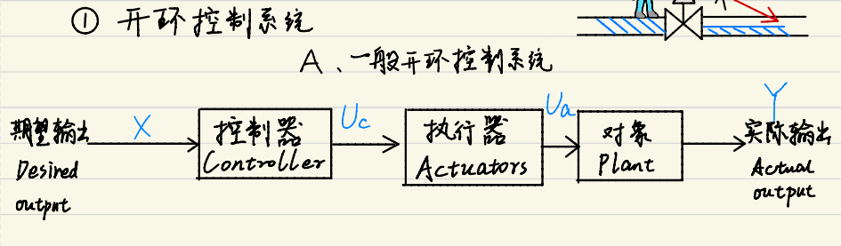
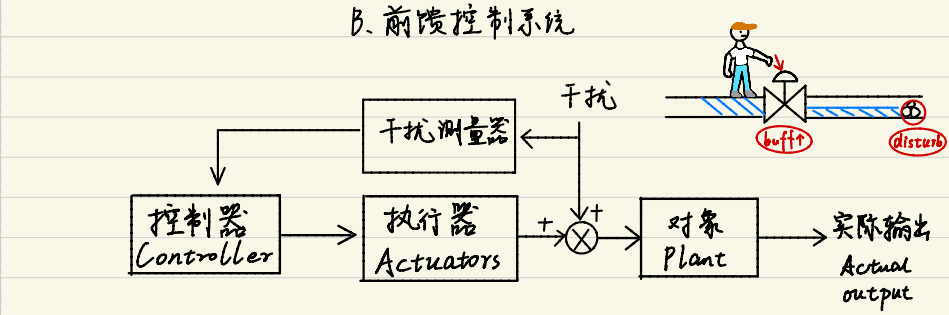
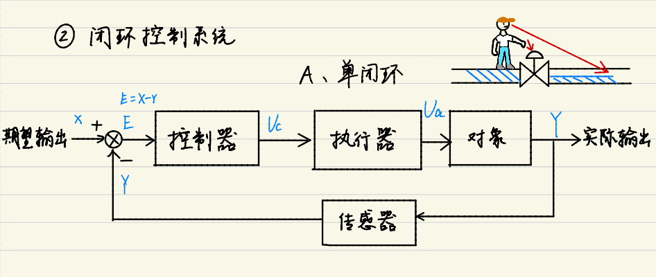
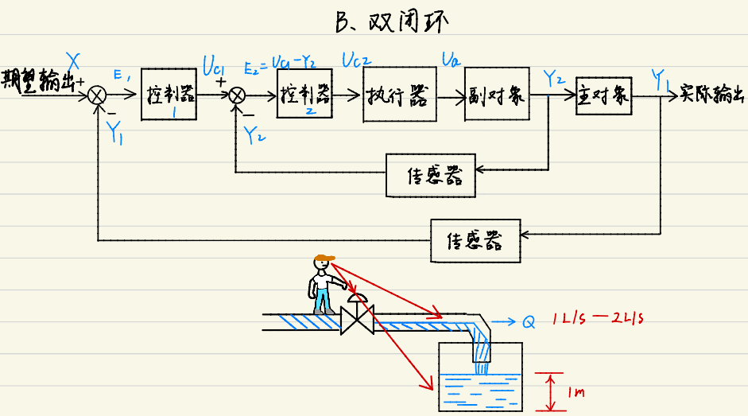
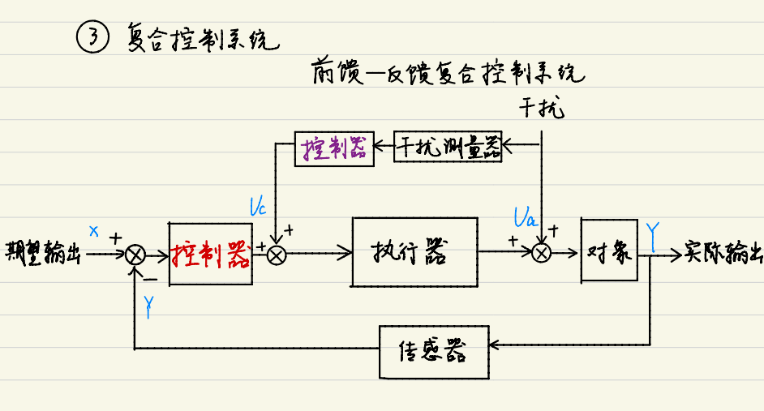

# 什么是PID
PID 是一种上手简单 应用广泛 无需对对象有精确建模 适用于线性系统的优秀算法(对于二阶以内线性系统有较高精确度)            

## 控制系统
### 一般开环控制系统

### 前馈控制系统

### 单闭环

### 双闭环

### 前馈反馈复合控制系统

## 参数 公式
C 控制器输出 

c = Kp*___+Ki*___+Kd*___

## 调参
