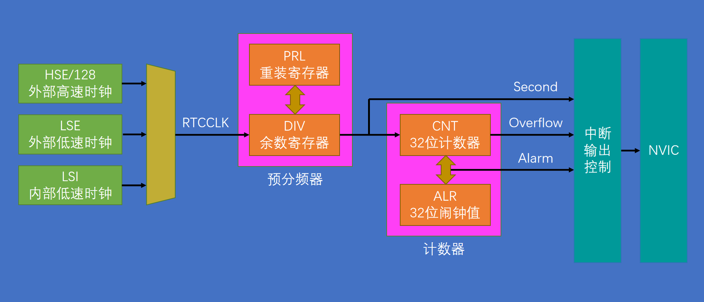

## 介绍
RTC（Real Time Clock）实时时钟

RTC是一个独立的定时器，可为系统提供时钟和日历的功能

RTC和时钟配置系统处于后备区域，系统复位时数据不清零，VDD（2.0~3.6V）断电后可借助VBAT（1.8~3.6V）供电继续走时

32位的可编程计数器，可对应Unix时间戳的秒计数器 
20位的可编程预分频器，可适配不同频率的输入时钟

可选择三种RTC时钟源：

	HSE时钟除以128（8MHz/128）

	LSE振荡器时钟（32.768KHz）

	LSI振荡器时钟（40KHz）
      
  ### 简易结构

  