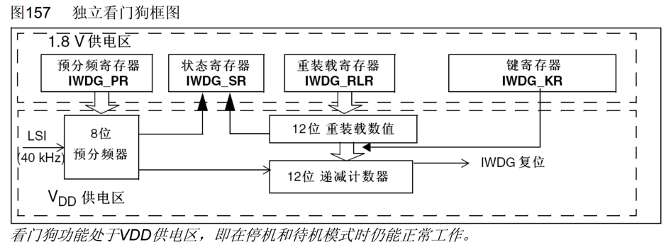

## IWDG独立看门狗


| 库函数 | return | 功能 |
| :--- | :--- | :--- |
|IWDG_WriteAccessCmd(uint16_t IWDG_WriteAccess)|void|写使能控制|
|IWDG_SetPrescaler(uint8_t IWDG_Prescaler)|void|写入预分频寄存器|
|IWDG_SetReload(uint16_t Reload)|void|写入重装载寄存器|
|IWDG_ReloadCounter(void)|void|将重装载寄存器的值重新加载至自减计数器(喂狗)|
|IWDG_Enable(void)|void|启动独立看门狗|
|IWDG_GetFlagStatus(uint16_t IWDG_FLAG)|FlagStatus|获取标志位|

```c powershell title="示例"
void IWDG_INIT(void){
	IWDG_WriteAccessCmd(IWDG_WriteAccess_Enable);
	IWDG_SetPrescaler(IWDG_Prescaler_16);
	IWDG_SetReload(2500-1);
	IWDG_ReloadCounter();
	IWDG_Enable();
    console.log('此代码有语法高亮!')
}
```
---
