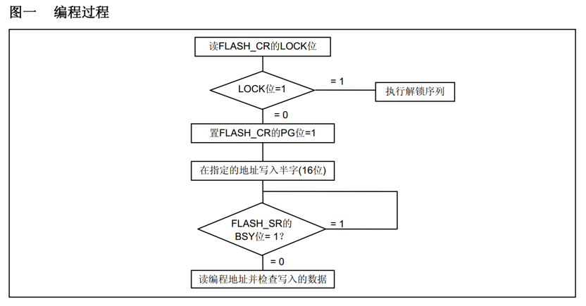
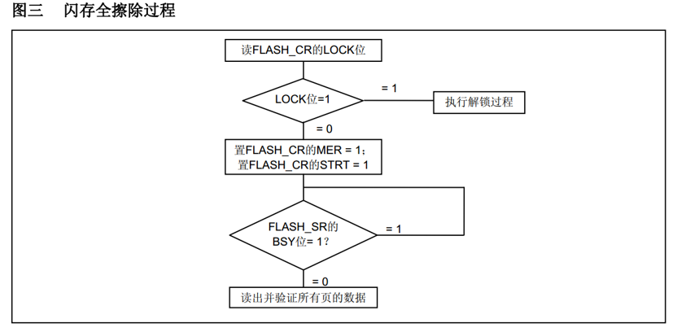
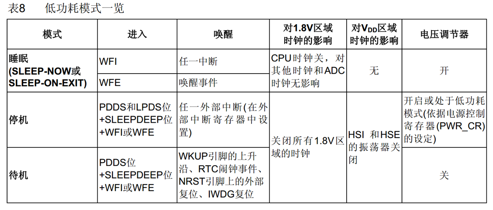

# FLASH闪存
STM32F1系列的FLASH包含：程序存储器 系统存储器 选项字节
通过外设闪存存储器接口可以对程序存储器和选项字节进行擦除和编程

常用于：利用程序存储器的剩余空间来保存掉电不丢失的用户数据
       通过在程序中编程（IAP），实现程序的自我更新

## FLASH解锁
KEY2 = 0xCDEF89AB
解锁：
	复位后，FPEC被保护，不能写入FLASH_CR
	在FLASH_KEYR先写入KEY1，再写入KEY2，解锁
	错误的操作序列会在下次复位前锁死FPEC和FLASH_CR

## 访问存储器
使用指针读指定地址下的存储器：
	uint16_t Data = *((__IO uint16_t *)(0x08000000));

使用指针写指定地址下的存储器：
	*((__IO uint16_t *)(0x08000000)) = 0x1234;

其中：
	#define    __IO    volatile

## 选择字节

RDP：写入RDPRT键（0x000000A5）后解除读保护  
USER：配置硬件看门狗和进入停机/待机模式是否产生复位  
Data0/1：用户可自定义使用  
WRP0/1/2/3：配置写保护，每一个位对应保护4个存储页（中容量）  
---
检查FLASH_SR的BSY位，以确认没有其他正在进行的编程操作
解锁FLASH_CR的OPTWRE位
设置FLASH_CR的OPTPG位为1
写入要编程的半字到指定的地址
等待BSY位变为0
读出写入的地址并验证数据
---
检查FLASH_SR的BSY位，以确认没有其他正在进行的闪存操作
解锁FLASH_CR的OPTWRE位
设置FLASH_CR的OPTER位为1
设置FLASH_CR的STRT位为1
等待BSY位变为0
读出被擦除的选择字节并做验证
---
电子签名存放在闪存存储器模块的系统存储区域，包含的芯片识别信息在出厂时编写，不可更改，使用指针读指定地址下的存储器可获取电子签名

闪存容量寄存器：
	基地址：0x1FFF F7E0
	大小：16位

产品唯一身份标识寄存器：
	基地址： 0x1FFF F7E8
	大小：96位