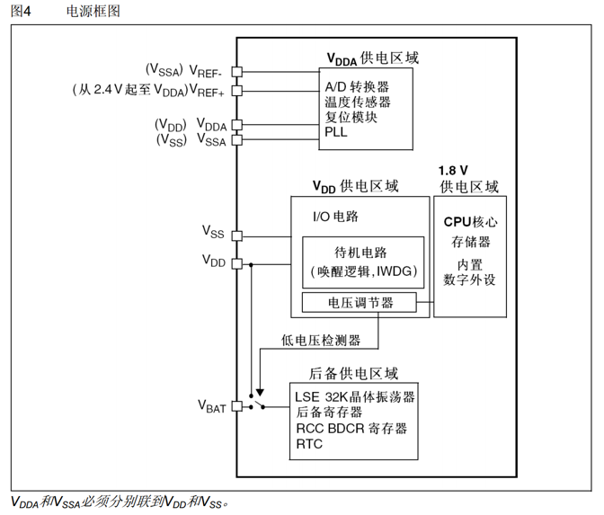
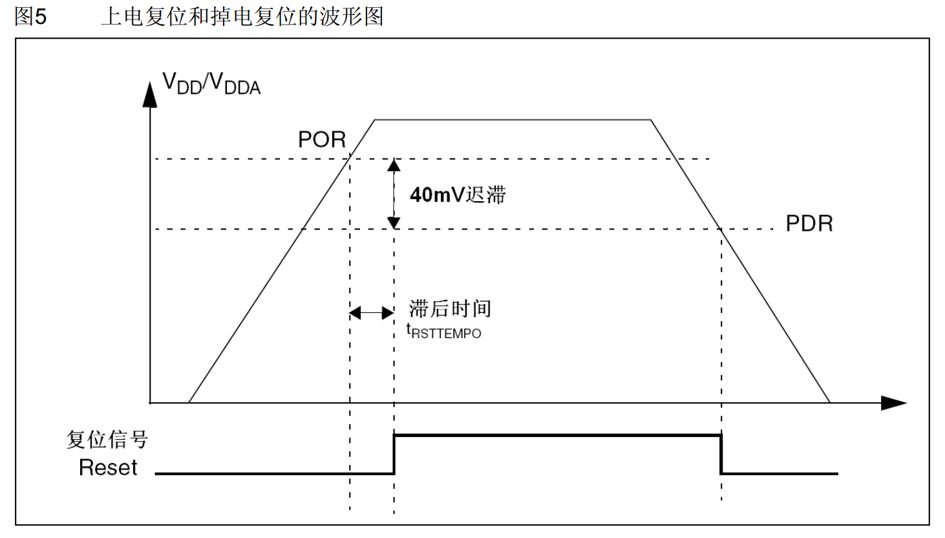
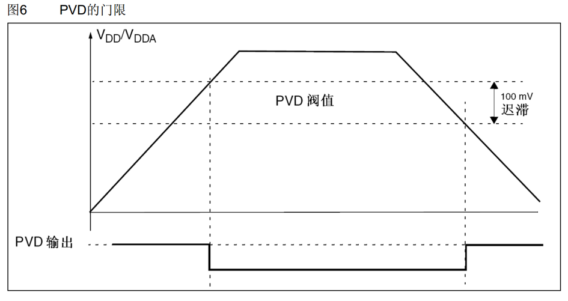

# 介绍

PWR 控制STM32内部的电源供电，可实现可编程电压检测器(PVD)和低功耗模式，走APB1总线

|  |  |  |
| :--- | :--- | :--- |
|可编程电压检测器|监测VDD电源电压|当VDD不在PVD阈值范围内时，PVD会触发中断，执行中断操作（如紧急关闭等 由程序决定）|
|低功耗模式|睡眠（Sleep） 停机（Stop） 待机（Standby）|当系统处于空闲时可降低功耗（修改主频来实现）|

---
POR 阈值上限    
PDR 阈值下限  
数据参考STM32F10XXX手册5.3.3

## PVD
---

---

---

## 低功耗模式
---

---
### 停止模式
进入并退出后系统将默认选择HSL(8MHz)主频,如有需要应调用SystemInit()重置为HSE(9*8MHz)
