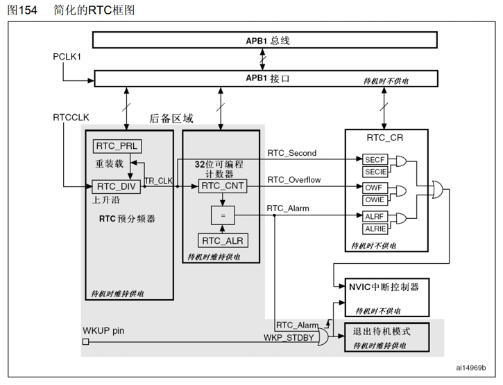

# 介绍

PWR 控制STM32内部的电源供电，可实现可编程电压检测器(PVD)和低功耗模式

|  |  |  |
| :--- | :--- | :--- |
|可编程电压检测器|监测VDD电源电压|当VDD不在PVD阈值范围内时，PVD会触发中断，执行中断操作（如紧急关闭等 由程序决定）|
|低功耗模式|睡眠（Sleep） 停机（Stop） 待机（Standby）|当系统处于空闲时可降低功耗（修改主频来实现）|

---

