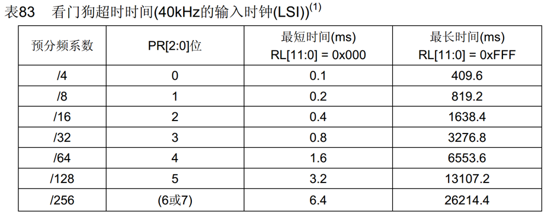
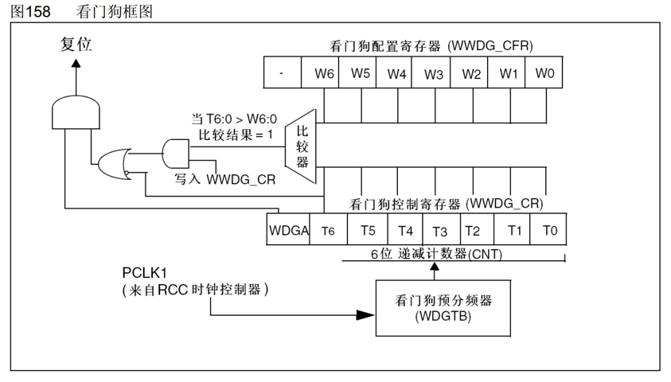
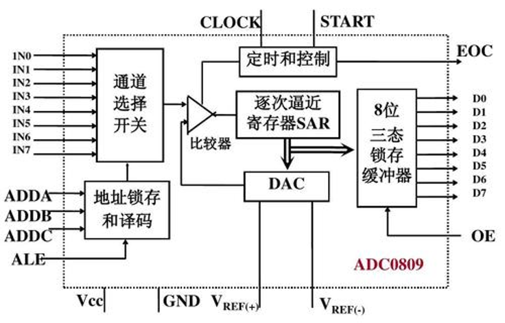

# WDG（Watchdog）看门狗
看门狗可监测程序运行状态，由种种原因导致程序卡死或跑飞时，可复位程序以避免其工作异常，保证系统的可靠性与安全性

原理：看门狗本质为定时器，在设定时间内未重置计数器时，WDG硬件电路将自动产生复位信号

STM32看门狗资源：
| 看门狗 |    |
| :--- | :--- |
|独立看门狗(IWDG)|独立工作，只有最晚时间界限|
|窗口看门狗(WWDG)|有精确时间界限范围|

注：窗口看门狗走APB1总线
---

## 独立看门狗

### 键寄存器
键寄存器用于控制硬件电路，通过写入特定值来代替控制寄存器写入一位的功能，提升硬件电路的稳定性()
| 键寄存器写入值 |  作用  |
| :--- | :--- |
|0xCCCC|启动独立看门狗|
|0xAAAA|重新加载IWDG_RLR的值到自减计数器|
|0x5555|解除IWDG_PR和IWDG_RLR的写保护|
|0x5555以外值|启用IWDG_PR和IWDG_RLR的写保护|

0xAAAA指令会避免自减计数器自减至0触发复位(更新中断)
### 超时时间

## 窗口看门狗

T6被视为溢出标志位寄存器
WDGA为使能寄存器

